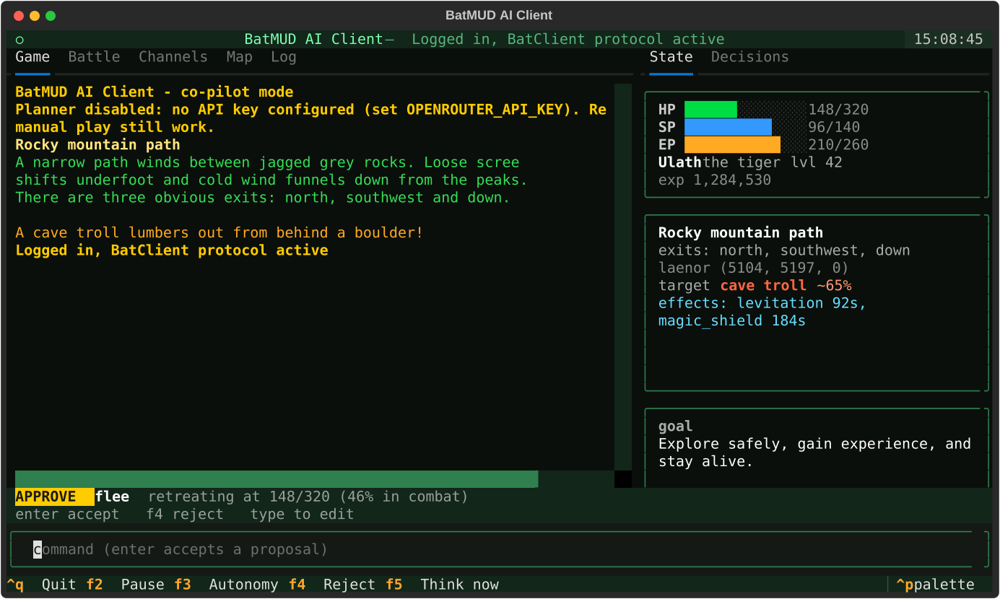
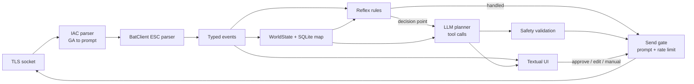

# BatMUD AI Client

An AI co-pilot for [BatMUD](https://www.bat.org). It reads the game through
BatMUD's own BatClient control-code protocol, keeps a persistent map, and
proposes commands you approve.



## Please read this first

[`help robot`](https://www.bat.org/help/help?htype=extra&str=robot) opens with:

> Using robot to _play_ is forbidden. You may not let your character on to
> perform actions when you are not directly involved.

It then draws a line that matters for how this client is built. Allowed:
triggers that report your hp/sp, highlight messages, eat or drink when you are
hungry, or "just cause you to appear non-idle". Forbidden — and note this
applies whether or not you are at the keyboard — triggers that "cause you to
cast spells or use skills based on text-input from the game" or that "cause you
to move around in the mud (in any way)". Fleeing automatically is the example
the rule itself gives.

So **co-pilot mode is the default**. The agent proposes a command, you press
Enter to accept it, type over it to change it, or F4 to throw it away. That
includes the emergency flee: it is a proposal, not an action, because a script
that moves your character on its own is exactly what the rule prohibits. Only
two things are sent without asking, both on the allowed list: acknowledging a
pager, and the anti-idle `look`.

`--autonomous` exists because the code supports it and it is useful for short
supervised experiments. Leaving it running while you are not there is a
bannable offence, and that is between you and the admins.

## What it does

- Reads **exact** health, spell points, endurance, level, experience, world
  coordinates, current target, active spell effects and cast progress from
  BatMUD's control codes, rather than pattern-matching them out of prose.
- Sends commands when the server says it is ready (`IAC GA`), not on a timer.
- Keeps a **persistent map** in SQLite, keyed by real world coordinates
  outdoors, and uses it for pathfinding and for finding unexplored ground.
- Handles emergencies **without** the model: pagers, fleeing at a health floor,
  staying quiet mid-cast, anti-idle. These are instant and free.
- Consults the model only at decision points, through **validated tools**. A
  tool call that cannot work comes back as an error the model can read.
- **Never shows the model your password.** Login is a state machine in the
  client, confirmed by control codes 05 and 06.

## Requirements

Python 3.12 or newer, and an [OpenRouter](https://openrouter.ai) API key if you
want the planner. Without a key the client still runs: reflexes work and you can
play manually.

## Install

```bash
git clone https://github.com/thevilledev/batmud-ai-client
cd batmud-ai-client
python -m venv .venv && source .venv/bin/activate
pip install -e .
```

## Run

```bash
export OPENROUTER_API_KEY=sk-or-...
export BATMUD_CHARACTER=YourCharacter
export BATMUD_PASSWORD=yourpassword

batmud
```

Make a new character instead:

```bash
BATMUD_PASSWORD=yourpassword batmud --mode create
```

Useful flags:

```bash
batmud --model anthropic/claude-sonnet-4   # pick a specific model
batmud --goal "Find the newbie shop and buy armour"
batmud --max-spend 1.00                    # stop planning after a dollar
batmud --autonomous                        # read the section above first
batmud --print-config                      # show resolved settings and exit
batmud --help
```

Copy [`batmud.example.toml`](batmud.example.toml) to `batmud.toml` to set
anything permanently. Settings resolve in this order: defaults, then the TOML
file, then environment variables, then command line flags.

## Keys

| Key | Action |
| --- | --- |
| `Enter` | Accept the proposed command, or send what you typed |
| Type, then `Enter` | Replace the proposal with your own command |
| `F2` | Pause and resume the agent |
| `F3` | Switch between co-pilot and autonomous |
| `F4` | Reject the proposal |
| `F5` | Ask the planner to think now |
| `Ctrl+L` | Clear the game view |
| `Ctrl+Q` | Quit |

Everything else you type goes to the command box, including `q`.

## How it works


```mermaid
flowchart LR
  socket[TLS socket] --> telnet[IAC parser<br/>GA to prompt]
  telnet --> bc[BatClient ESC parser]
  bc --> events[Typed events]
  events --> world[WorldState + SQLite map]
  events --> reflex[Reflex rules]
  world --> reflex
  reflex -->|handled| gate[Send gate<br/>prompt + rate limit]
  reflex -->|decision point| planner[LLM planner<br/>tool calls]
  world --> planner
  planner --> safety[Safety validation]
  safety --> gate
  gate --> socket
  events --> tui[Textual UI]
  planner --> tui
  tui -->|approve / edit / manual| gate
```

### The protocol

Sending `ESC bc 1` on connect switches the server into
[BatClient mode](https://www.bat.org/forum/lofiversion/index.php/t477.html).
The game then emits structured data inline with normal text: codes `50`/`51`
for vitals, `52` for identity, `60` for continent and X/Y/Z coordinates, `64`
for spell effects, `70` for the current target and its health, `41`/`42` for
cast progress, `10` to classify each message, `05`/`06` for the login result,
and `20`–`25` for 24-bit colour.

The parser is a single byte-at-a-time state machine handling both `IAC` and
`ESC` tags, fed incrementally, so a tag split across two reads parses the same
as one that is not. Tests replay recorded bytes chopped at every offset to keep
it that way.

If the control codes never appear, the client says so in the interface, falls
back to parsing text, and tells the planner its state may be stale.

### Two tiers of decision

Reflexes are deterministic, ordered by priority, individually rate limited, and
cost nothing. They answer pagers, propose fleeing below a health floor, stay
silent while control codes 41/42 report a cast in progress, and poke the game
before it considers you idle. Whether a reflex may act on its own or has to ask
first is decided by `help robot`, as described above.

The planner is asked only when something happened worth thinking about: a new
room, combat starting or ending, a level, or a stretch of nothing. It answers
with a tool call — `move`, `travel_to`, `explore`, `attack`, `remember`,
`set_goal`, `recall`, `wait`, `raw_command` — validated against the world model
before it becomes a command.

If a call is invalid, the model is told why. Walking west where there is no west
exit returns *"There is no west exit here. Exits from 'Village road': north,
south."* The previous version of this client silently substituted a different
exit, so the model never learned anything.

### Safety

Every command, whoever proposed it, passes the same guard: a denied command
list, denied patterns, a refusal to send anything containing your password, a
rate limit, and a per-session cap on requests, tokens and spend. Communication
commands are blocked by default so the agent cannot talk to other players as
you.

## Layout

```
src/batmud/
  cli.py  config.py       entry point; TOML + environment + flags
  protocol/
    telnet.py             asyncio + TLS, IAC state machine, GA as prompt
    batclient.py          incremental ESC tag parser with a tag stack
    events.py             typed events
  world/
    state.py              authoritative state, written by control codes
    room.py map.py        room/exit parsing; SQLite map and pathfinding
  agent/
    reflexes.py           deterministic rules
    safety.py             guard, rate limit, budget
    tools.py              the validated actions the planner may take
    planner.py memory.py  the model, goals and notes
  llm/client.py           OpenRouter, backoff, cost accounting
  session/
    login.py runner.py    login state machine; the main loop
  tui/app.py widgets.py   the interface
```

## Development

```bash
pip install -e '.[dev]'
pytest          # 237 tests
ruff check .
ruff format .
mypy
```

Tests are offline: the protocol suite replays a recorded capture of the real
login banner, and the planner tests script the model's responses.

## Credits

Thanks [@errnoh](https://github.com/errnoh) for the idea!

## Licence

MIT. See [LICENSE](LICENSE).
