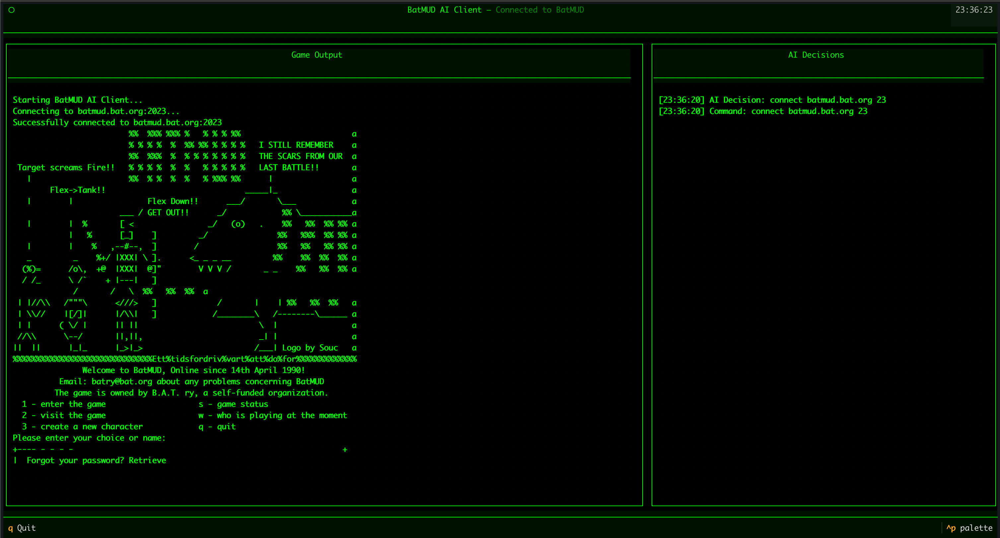

# BatMUD AI Client

An AI-powered client for BatMUD that uses Claude 3 Opus to play the game autonomously.



## Prerequisites

- Python 3.12+
- Anthropic API key

## Setup

1. Clone the repository

```bash
git clone https://github.com/thevilledev/batmud-ai-client.git
```

2. Install dependencies (`venv` recommended):

```bash
pip install -r requirements.txt
```

3. Set environment variables:

```bash
export ANTHROPIC_API_KEY=<your-anthropic-api-key>
export BATMUD_NAME_PREFIX=<your-name-prefix>  # Default: "claude"
export BATMUD_PASSWORD=<your-password>        # Default: "simakuutio"
```

## Running the client

```bash
python main.py
```

The client will automatically:
- Connect to BatMUD
- Create a character if needed
- Explore the world
- Engage in combat

## Controls

- `q` - Quit the application
- `p` - Pause/Resume AI actions (game output still updates)
- `l` - Toggle debug logs view

## Features

- Terminal User Interface (TUI) with split views for game output and AI decisions
- Debug logs view accessible with 'l' key
- Pause functionality to temporarily stop AI actions
- Automatic character creation
- Intelligent combat handling
- All stdout/stderr is captured to logs view

## Debugging

- Debug logs are saved to 'batmud.log'
- Press 'l' to view logs in the application
- Pause the game with 'p' to inspect state without AI interference

## API limitations

Claude 3 Opus has a token limit of 1M tokens per day. You may tune the `game_state_length` in `main.py` to reduce the amount of context saved (default: 500 characters).

## Credits

Thanks [@errnoh](https://github.com/errnoh) for the idea!

## License

MIT
